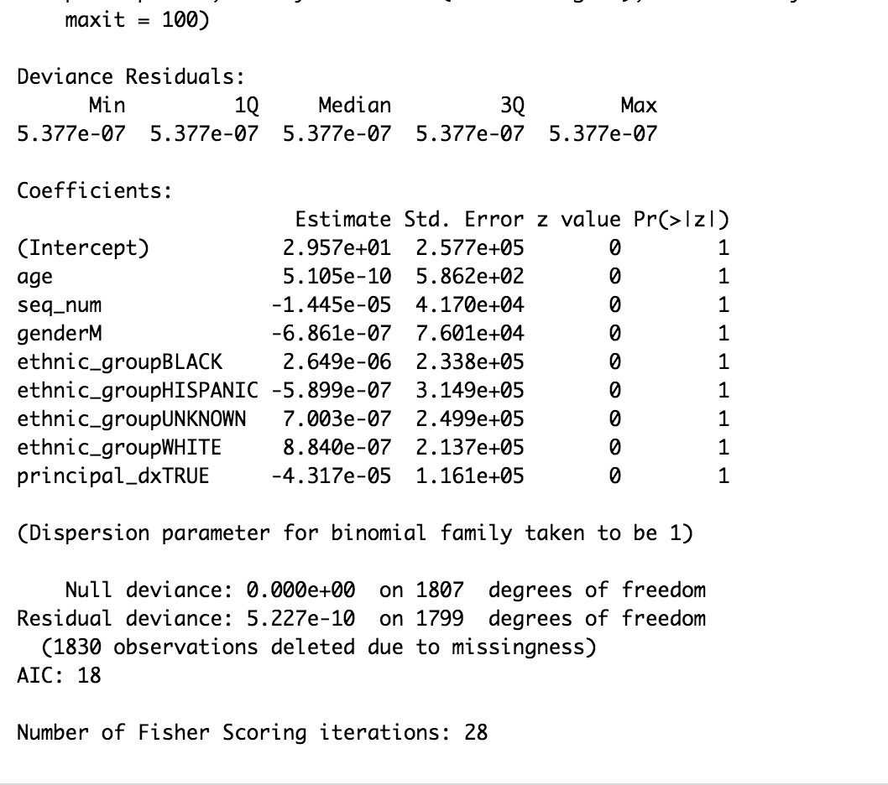
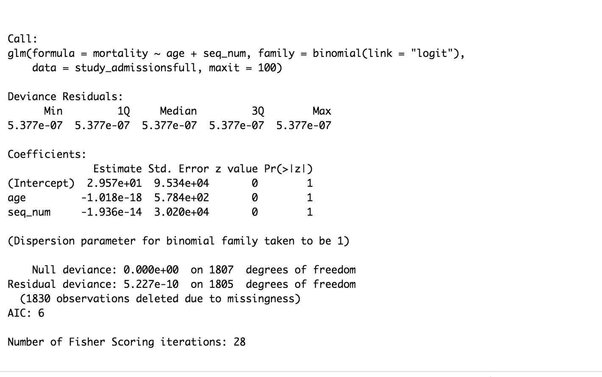

```{r setup, include=FALSE}
knitr::opts_chunk$set(echo = TRUE)
```

# Task

In this assignment, you are to write a report analyzing the electronic health record (EHR) data MIMIC-III. You report will demostrate your knowledge of working with PostgreSQL database, data visualization, and commonly used analytical methods such as logistic regression and neural network. Your report should include at least following parts:  

1. An informative title. _30-Day Mortality Rate of Respiratory Patients Admitted to CCU_ 

2. Introduction. Describe the MIMIC-III data set and what research hypothesis/goal you are to address using this data. **Introduction:** I used the d_icd_diagnoses to obtain the patients who were diagnosed with any respiratory illness and diagnoses_icd to look up the code for the diagnoses. The table of admissions to MICU and table of admissions for the respiratory diagnoses was used. Hypothesis: Patients who were diagnosed with any respiratory illness and admitted into the MICU have a high chance of dying within 30 days as it is one of the top 10 causes of death according to the World Health Organization.

3. Data preparation. Create a study cohort from MIMIC-III corresponding to your research hypothesis/goal. See the examplary code below. Use a CONSORT flow diagram to summarize your steps to create the cohort.

**Solution:** The cohorts that were generalized were the patients that excluded those that were not admitted to the MICU and the patients that were not primarily diagnosed with respiratory illness. 

4. Data visualization. Use visualization to summarize the cohort you created. 

**Solution:** There were a couple of data visualizations, but the focus is looking at those that were primarily diagnosed with respiratory illness, which are seq_1 and the total counts of mortality so we can see if there was a trend in death. In this case, we could also see how many others that were not primarily diagnosed with respiratory illness, which turns out to be more than those that were primarily diagnosed. 

5. Analytics. Use at least two analytical approaches to address your research hypothesis/goal. For example, we can use (1) logistic regression and (2) neural network to build a predictive model for the 30-day mortality rate of patients admitted into the MICU and compare their predictive performance. Summarize your results in graphs.
**Solution:** A logistic regression was performed by looking at seq_num and mortality, but the data for both of the variables are discrete rather than continuous thus a linear graph was shown. A neural network was supposed to be built, but it crashed. I provided some examples of what the model should look like, splitting the data to train and test that worked, but not through the model. 

6. Conclusions. 
**Solution:** Based on the graphs that were displayed before doing part 5, shows that the combination of seq_num of 2-5 all together had a much higher mortality rate than seq_num = 1. Just in seq_num = 1, there are about 500 deaths and about 390 that were labeled NA, thus showing that there could is a slightly higher chance of dying, maybe with the contribution of other variables. Based on the linear regression, it seems like the higher the seq_num, the lower the mortality. 

Note: There are some commands that didn't seem to work, even though it wasn't changed. Just in case, I have some screenshots of the logistic regression that I was able to do. 

<p align="center">
  
</p>

<p align="center">
  
</p>


# Learning resources about analyzing EHR data

- _Secondary Analysis of Electronic Health Records_: <https://link.springer.com/book/10.1007/978-3-319-43742-2> 

- _The Book of OHDSI_: <https://ohdsi.github.io/TheBookOfOhdsi/>. 

- The GitHub repository <https://github.com/MIT-LCP/mimic-code> contains some code examples for working with the MIMIC-III data. Following sample code derives from <https://github.com/MIT-LCP/mimic-code/blob/master/tutorials/dplyr-frontend/intro.md>. 

# Examplary code

## Connect to PostgresSQL database


Load database libraries and the tidyverse frontend:
```{r}
library(DBI)
library(RPostgreSQL)
library(tidyverse)
library(lubridate)
library(plyr)
library(dplyr)
library(ggplot2)
library(tibble)
library(tidyr)
```

Credentials for using PostgreSQL database. We are going to use username `postgres` with password `postgres` to access the `mimic` database in the schemee `mimiciii`. 
```{r}
# Load configuration settings
dbdriver <- 'PostgreSQL'
#host  <- '127.0.0.1'
#port  <- '5432'
user  <- 'postgres'
password <- 'postgres'
dbname <- 'mimic'
schema <- 'mimiciii'
# Connect to the database using the configuration settings
con <- dbConnect(RPostgreSQL::PostgreSQL(), 
                 dbname = dbname, 
                 #host = host, 
                 #port = port, 
                 user = user, 
                 password = password)
# Set the default schema
dbExecute(con, paste("SET search_path TO ", schema, sep=" "))
con
```
List tables in the `mimic` database:
```{r}
dbListTables(con)
```
An example SQL query:
```{r}
sql_query <- "SELECT i.subject_id, i.hadm_id, i.los
              FROM icustays i;"
(data <- dbGetQuery(con, sql_query)) %>% as_tibble()
```
```{r}
#This document shows how RMarkdown can be used to create a reproducible analysis using MIMIC-III (version 1.4). Let's calculate the median length of stay in the ICU and then include this value in our document.
(avg_los <- median(data$los, na.rm=TRUE))
(rounded_avg_los <- round(avg_los, digits = 2))
```


## Connect to a table in database

To connect to the `patients` table in the database:
```{r}
patients <- tbl(con, "patients")
patients %>% print(width = Inf)
```
We can see this connection is lazy (does not load the whole table into computer memory)
```{r}
str(patients)
```
To load the entire table into memory we may use
```{r}
collect(patients)
```
But keep in mind that the point of using a database software is that the data tables are potentially large and we prefer to use database to do on disk computations as much as possible. So in this assignment we will avoid loading whole tables into memory as much as we can. 

## Query and subsetting

In this section, we demo how to create a cohort of patients who were directly admitted into CCU and were diagnosed with tuberculosis.

First we create a (query) table of patients who were directly admitted into MICU (Medical Intensive Care Unit).
```{r}
tbl(con, "transfers") %>%
  select(subject_id, hadm_id, prev_careunit, curr_careunit) %>%
  filter(is.na(prev_careunit) & curr_careunit == "MICU") %>%
  select(subject_id, hadm_id) %>%
  distinct() %>%
  print() -> micu_admissions
```
```{r}
tbl(con, "transfers") %>%
  group_by(subject_id, hadm_id) %>%
print() -> all_admissions
```

Restrict to patients with respiratory illness. Found all possible ICD-9 codes related to respiratory illnesses, we search for the string 'tuberculosis' in the column long_title from the table d_icd_diagnoses. There are 92 codes that deal with respiratory illnesses. 
```{r}
tbl(con, "d_icd_diagnoses") %>%
  filter(str_detect(tolower(long_title), "respiratory")) %>%
  print() -> resp_codes
```

`diagnoses_icd` table stores the diagnosis of each admission. We use `semi_join()` to keep the rows in `diagnoses_icd` that match the ICD-9 codes related to respiratory illness. There are 1000 patients that are diagnosed with respiratory illness.
```{r}
tbl(con, "diagnoses_icd") %>%
  semi_join(resp_codes, by = "icd9_code") %>%
  print() -> resp_admissions
```

The `seq_num` field is a priority ranking for the diagnoses generated at the end of stay. In order to focus on patients for whom respiratory illness was central to their hospitalization, we will include records with respiratory illness in any of the first five diagnosis positions, according to the `seq_num` field. To avoid duplicate admissions, we use `group_by()` and `top_n()` to limit the query to the first respiratory diagnosis for each admission. Now there are 1000 patients that were admitted to hospitalization, with repeated subjects. 
```{r}
resp_admissions %>%
  filter(seq_num <= 5) %>%
  group_by(subject_id, hadm_id) %>%
  #top_n(1, wt = seq_num) %>% #  not working. bug? use following as workaround
  filter(min_rank(seq_num) <= 1) %>%
  ungroup() %>%
  select(subject_id, hadm_id, icd9_code, seq_num) %>%
  print() -> resp_admissions
```
Now we `inner_join` the table of admissions to MICU and the table of admissions that include respiratory diagnosis. 1000 patients got admitted to the MICU that have respiratory illness. 
```{r}
micu_admissions %>%
  inner_join(resp_admissions, by = c("subject_id", "hadm_id")) %>%
  print() -> study_admissions
```

## Transform and augment query tables

Created a logical variable indicating if respiratory illness was the principal diagonosis or not, whether the seq_num is 1 then it is the principal diagnosis. 

```{r}
study_admissions %>%
  mutate(principal_dx = seq_num == 1) %>%
  #select(-seq_num) %>%
  print() -> study_admissions
```
Create graph based on the seq_num, dealing with the primary diagnoses of respiratory illness. There are about 1000 patients who are seq_num = 1.
```{r}
study_admissions %>% 
  group_by(principal_dx) %>%
  summarize(count = n()) %>%
  ggplot(aes(x = principal_dx, y = count)) +
  geom_col()
```

We want to add information about the severity of patients’ ailments. The `drgcodes` table contains, for `DRG` codes from the All Payers Registry (APR), severity and mortality indicators. We pull the drug severity information and right-join it to our query table. 
```{r}
tbl(con, "drgcodes") %>%
  filter(str_detect(drg_type, "APR")) %>%
  select(subject_id, hadm_id, drg_severity) %>%
  right_join(study_admissions, by = c("subject_id", "hadm_id")) %>%
  #mutate(drg_severity = ifelse(is.na(drg_severity), 1, drg_severity)) %>%
  print() -> study_admissions
```

Pull the admission time `admittime`, discharge time `dischtime`, date of birth `dob`, and date of death `dod`. We are interested in the mortality rate 30 days after discharge. So we only keep patients who didn't die in hospital.

```{r}
study_admissions %>%
  left_join(
    select(tbl(con, "admissions"),
           subject_id, hadm_id, admittime, dischtime, hospital_expire_flag
    ), by = c("subject_id", "hadm_id")
  ) %>%
  filter(hospital_expire_flag == 0) %>% # patients who did not die in hospital
  select(-hospital_expire_flag) %>%
  left_join(
    select(tbl(con, "patients"), subject_id, dob, dod),
    by = "subject_id"
  ) %>%
  print(width = Inf) -> study_admissions
```

Created a new column for the age of death and the mortality column is to see if the death is within 30 days of discharge. Subjects with respiratory illness, age, drug severity, etc...are included. 
```{r}
study_admissions %>%
  mutate(tt_death = date_part("day", dod) - date_part("day", dischtime)) %>%
  mutate(mortality = tt_death <= 30) %>%
  mutate(age = date_part("year", admittime) - date_part("year", dob)) %>%
  mutate(age = age - ifelse(
    date_part("month", admittime) < date_part("month", dob) |
      (
        date_part("month", admittime) == date_part("month", dob) &
          date_part("day", admittime) < date_part("day", dob)
      ),
    1,
    0
  )) %>%
  select(-admittime, -dischtime, -dob, -dod, -tt_death) %>%
  select(subject_id, hadm_id, age, mortality, everything()) %>%
  print() -> study_admissions
```
Many mortality indicators are missing, due to neither the hospital database nor the social security database having a record of these patients’ deaths. We could convert these to `FALSE` values, but it may be helpful to retain in the analytic table this information on whether deaths were recorded at all, e.g. for validation or sensitivity testing.


Finally, let's merge some demographic information (ethnicity, gender) into our study `study_admissions`.
```{r}
tbl(con, "admissions") %>%
  select(subject_id, ethnicity) %>%
  distinct() %>%
  print() -> study_subjects
```
```{r}
tbl(con, "patients") %>%
  select(subject_id, gender) %>%
  distinct() %>%
  full_join(study_subjects, by = "subject_id") %>%
  print() -> study_subjects
```
```{r}
study_subjects %>%
  semi_join(study_admissions, by = "subject_id") %>%
  print() -> study_subjects
```
Let's resolves ome diversity and inconsistency in the `ethnicity` field:
```{r}
unknown_ethnicity <- c(
  "OTHER",
  "UNABLE TO OBTAIN",
  "UNKNOWN/NOT SPECIFIED",
  "MULTI RACE ETHNICITY",
  "PATIENT DECLINED TO ANSWER",
  "UNKNOWN"
)

study_subjects %>%
  collect() %>%
  mutate(ethnic_group = case_when(
    str_detect(ethnicity, "^ASIAN") ~ "ASIAN",
    str_detect(ethnicity, "^BLACK") ~ "BLACK",
    str_detect(ethnicity, "^HISPANIC") ~ "HISPANIC",
    str_detect(ethnicity, "^WHITE") ~ "WHITE",
    ethnicity %in% unknown_ethnicity ~ NA_character_,
    TRUE ~ NA_character_
  )) %>%
  select(subject_id, gender, ethnic_group) %>%
  print() -> study_subjects
```

Some patients are coded as belonging to more than one ethnic group. To resolve these inconsistencies, we define a helper function to pick the modal value from a vector of values in R, which can be used by the `summarize()` function to choose one ethnic group for each patient.
```{r}
most <- function(x) {
  if (all(is.na(x))) return(NA_character_)
  y <- table(x, useNA = "no")
  if (length(which(y == max(y))) > 1) return(NA_character_)
  return(names(y)[which.max(y)])
}

study_subjects %>%
  group_by(subject_id) %>%
  summarize(ethnic_group = most(ethnic_group)) %>%
  ungroup() %>%
  mutate(ethnic_group = ifelse(is.na(ethnic_group), "UNKNOWN", ethnic_group)) %>%
  print() -> subject_ethnic_groups
```
```{r}
study_subjects %>%
  select(subject_id, gender) %>%
  left_join(subject_ethnic_groups, by = "subject_id") %>%
  print() -> study_subjects
```
Now we add the demographic information `gender` and `ethnicity` into our `study_admissions` table:
```{r}
study_admissions %>%
  left_join(study_subjects, by = "subject_id", copy = TRUE) %>%
  print() -> study_admissions
```

Filtered the amount of subjects that were repeated. 
```{r}
study_admissions %>%
  group_by(subject_id, hadm_id) %>%
  filter(row_number() == 1) %>%
  #mutate_all(~replace(., is.na(.), 0)) %>%
  print() -> study_admissionsfull 
```

Let's try to select the patients that have a 30 day mortality rate that were admitted to the MICU primarily from respiratory illness. There is a total of 890 subjects primarily diagnosed with respiratory illness, we have found that subjects have the icd9_code of 51881 which is acute respiratory failure.
```{r}
study_admissionsfull %>%
  group_by(subject_id, hadm_id) %>%
  filter(row_number() == 1) %>%
  filter(seq_num == 1) %>%
print() -> study1
```
 Graph primary diagnosis of respiratory illness to the number of mortality.
```{r}
study_admissionsfull %>%
  group_by(seq_num, mortality) %>%
  summarize(count = n()) %>%
  ggplot(aes(x = seq_num, y = count)) +
  geom_col()
```

Data visualization for the number of 30-day mortality and those that have survived. There are 500 deaths after 30 days and there are 390 that are labeled NA. 
```{r}
study1 %>%
  group_by(mortality) %>%
  summarize(count = n()) %>%
  ggplot(aes(x = mortality, y = count)) +
  geom_col()
```
Grouped by careunits. 
```{r}
all_admissions %>%
  group_by(curr_careunit) %>%
  summarize(count = n()) %>%
  ggplot(aes(x = curr_careunit, y = count)) +
  geom_col()
```

```{r}
study_fulldf <- as.data.frame(study_admissionsfull) 
```
Data frame with mortality values of 0 and 1, which are NA and TRUE, respectively. 
```{r}
x <- study_fulldf
x[, 4][is.na(x[, 4])] <- 0
head(x)
```

Question 5 - Analytics. Use at least two analytical approaches to address your research hypothesis/goal. 
**Part 1: Logistic Regression**

This logistic regression is done to see how multiple variables affect mortality. The second logistic regression that is done after this one looks at seq_num and other variables, which can affect the 30 day mortality.
```{r}
logistic_respmort <- glm(mortality ~ age + seq_num + gender + ethnic_group + 
                     principal_dx, data = study_admissionsfull,
                     family = binomial(link = "logit"), maxit = 100)
```

```{r}
summary(logistic_respmort)
```

```{r}
logistic_respmort$coef
```
This specific summary and logistic regression should be used for supporting the hypothesis.
```{r}
logistic_seq_num <- glm(mortality ~ seq_num, data = x,
                     family = binomial(link = "logit"), maxit = 100)
```

```{r}
summary(logistic_seq_num)
```
Tried to graph a logistic regression, but this was resulted instead. From this graph, those that are primarily diagnosed with respiratory illness is more likely to die within 30 days compared to the higher seq_num. 
```{r}
M.df <- data.frame(seq_num = seq(1:5))

#Predict the Coast values (as a probability) using the above data
M.df$mortality <- predict(logistic_seq_num, newdata=M.df, type="response")

# Plot the modeled probability values
ggplot(M.df, aes(x=seq_num, y= mortality)) + geom_line()

```
```{r}
as.numeric(x$mortality)
```
Tried to plot data from seq_num and mortality, but not the most meaningful representation.  
```{r}
ggplot(x, aes(x=seq_num, y=as.numeric(x$mortality))) + 
  geom_point(alpha=.5) +
  stat_smooth(method="glm", se=FALSE, method.args = list(family=binomial)) + 
  ylab("mortality") 
```


**Part 2: Neural Network**
```{r}
library(keras)
install_keras(tensorflow = "gpu")
```

```{r}
head(study_admissionsfull)
```
Converting tibble to data frame.
```{r}
study_fulldf <- as.data.frame(study_admissionsfull) 
```

Converting data frame into matrix
```{r}
study_fullma <- data.matrix(study_fulldf)
```
Training portion of the data.
```{r}

max_features <- 200000
batch <- 32

maxlen <- 80

df <- study_fulldf

idx <- sample(seq(1, 2), size = nrow(df), replace = TRUE, prob = c(.8, .2))
x.train <- df[idx == 1,]
y.train <- df[idx == 2,]
x.test <- df[idx == 1,]
y.test <- df[idx == 2,]
#validation <- df[idx == 3] if needed use the 3rd probability

cat(length(x.train), 'train sequences\n')
cat(length(x.test), 'test sequences\n')

#test_df <- as_tibble(test)
#test_df
```

Examples of model building, but the model crashes also keras_model_sequential cannot be found.
```{r}
model <- keras_model_sequential() 

model %>%
  layer_dense(units = 64, activation = "relu", input_shape = ncol(x_data)) %>%
  layer_dense(units = 64, activation = "relu") %>%
  layer_dense(units = ncol(y_data_oneh), activation = "softmax")

model %>% compile(
  loss = 'binary_crossentropy',
  optimizer = 'adam',
  metrics = c('accuracy')
)
summary(model)
```

```{r}
model <- keras_model_sequential() %>%
         layer_dense(units = 5,
                     activation = "sigmoid",
                     input_shape = dim_desc(train)) %>%
         layer_dense(units = 5, activation = "sigmoid") %>%
         layer_dense(units = 1)

```


## Close the connection to a database

Close the connection:
```{r}
dbDisconnect(con)
```


## CONSORT Flow Diagrams

CONSORT Flow Diagrams can be used to plot the flow of data selection of a patient cohort.   
For more details, see:
[The CONSORT Flow Diagram](http://www.consort-statement.org/consort-statement/flow-diagram). Following code shows an example. 

```{r plot}
library(shape)
library(diagram)

# set margins and multiplot
par(mfrow = c(1, 1))
par(mar = c(0, 0, 0, 0))

# initialise a plot device
openplotmat()

# position of boxes
# 1st column indicates x axis position between 0 and 1
# 2nd column indicates y axis position between 0 and 1
# automatically assigns vertical position
num_of_boxes <- 4
auto_coords = coordinates(num_of_boxes)
vert_pos = rev(auto_coords[,1])
box_pos <- matrix(nrow = num_of_boxes, ncol = 2, data = 0)
box_pos[1,] = c(0.20, vert_pos[1]) # 1st box
box_pos[2,] = c(0.70, vert_pos[2]) # 2nd box
box_pos[3,] = c(0.70, vert_pos[3]) # 3rd box
box_pos[4,] = c(0.20, vert_pos[4])

# content of boxes
box_content <- matrix(nrow = num_of_boxes, ncol = 1, data = 0)
box_content[1] = "All patients in MIMIC-III \n n = 58,976" # 1st box
box_content[2] = "Exclude patients not admitted to MICU \n n= 57,976" # 2nd box
box_content[3] = "Exclude patients not primarily diagnosed with resp \n n = 110" # 3rd box
box_content[4] = "Study cohort \n n = 890"

# adjust the size of boxes to fit content
box_x <- c(0.20, 0.25, 0.27, 0.20)
box_y <- c(0.07, 0.07, 0.07, 0.07)

# Draw the arrows
straightarrow(from = c(box_pos[1,1],box_pos[2,2]), to = box_pos[2,], lwd = 1)  
straightarrow(from = c(box_pos[1,1],box_pos[3,2]), to = box_pos[3,], lwd = 1)  
straightarrow(from = box_pos[1,], to = box_pos[4,], lwd = 1)

# Draw the boxes
for (i in 1:num_of_boxes) {
  textrect(mid = box_pos[i,], radx = box_x[i], rady = box_y[i], 
           lab = box_content[i], 
           shadow.col = "grey")
  }
```


## Install PostgreSQL and `RpostgreSQL` package on CentOS

This is a note to myself (Dr. Hua Zhou). The postgres in yum is an old version. We want to install the most recent postgres and then build the `RpostgreSQL` package based on it. 

1. Follow instructions in <https://www.digitalocean.com/community/tutorials/how-to-install-and-use-postgresql-on-centos-7> to install PostgreSQL 11 on CentOS 7. 

2. Issue following command to install `RPostgreSQL` in R:
```{bash, eval = F}
sudo R -e 'Sys.setenv(PG_INCDIR="/usr/pgsql-11/include/"); Sys.setenv(PG_LIBDIR="/usr/pgsql-11/lib/"); install.packages("RPostgreSQL")'
```
